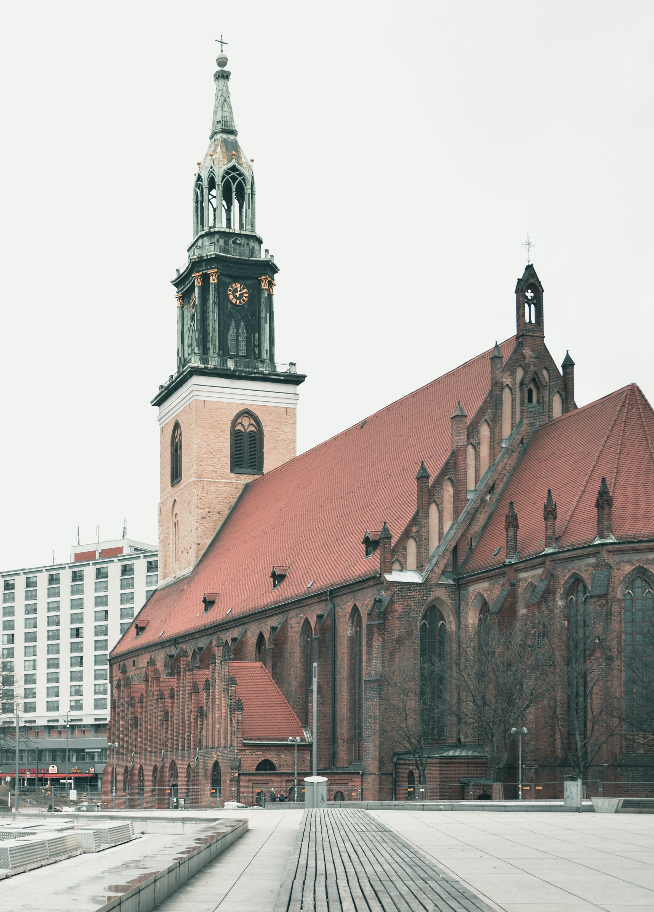
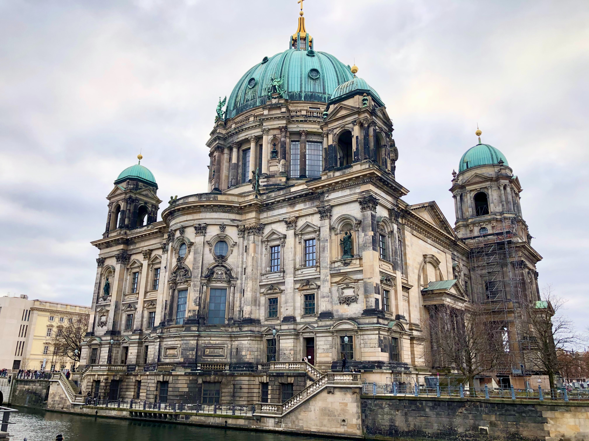
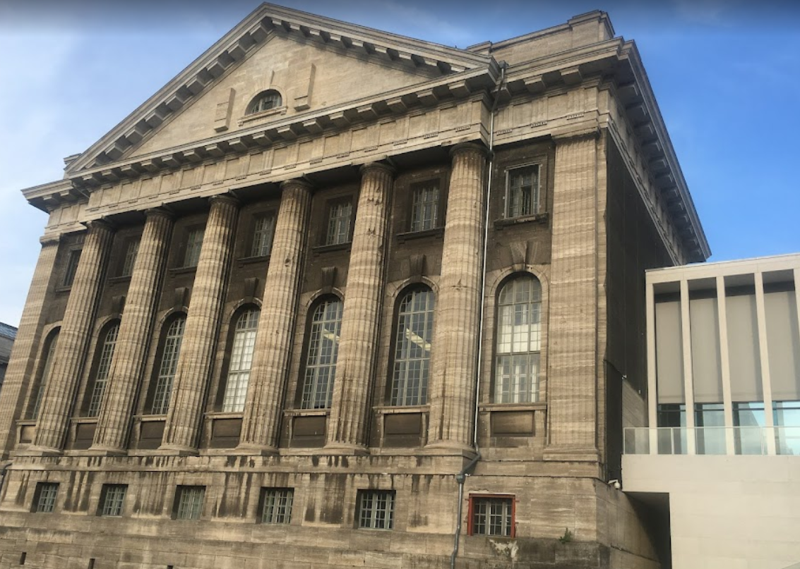
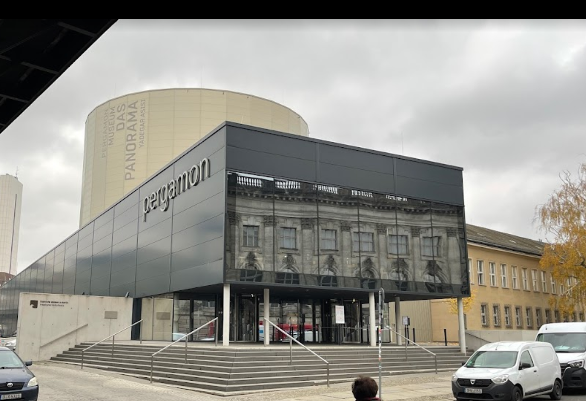
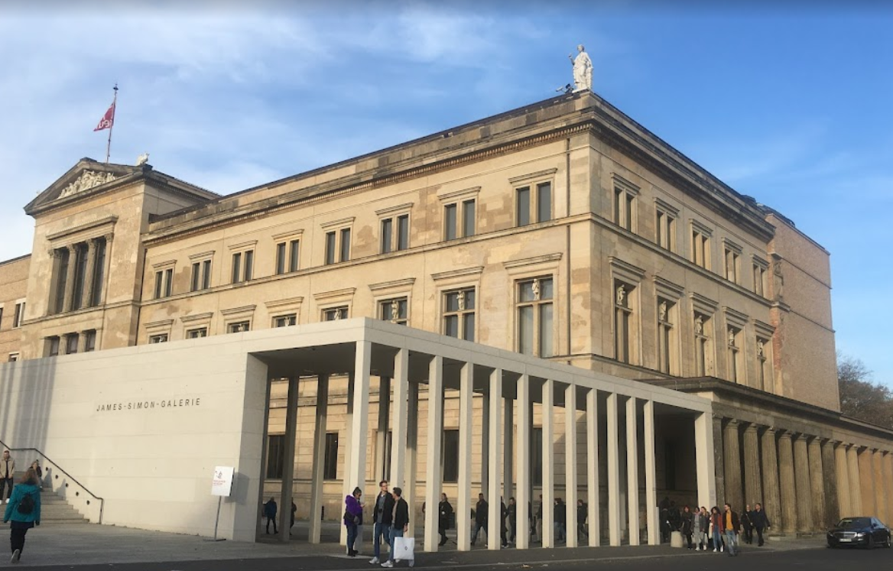
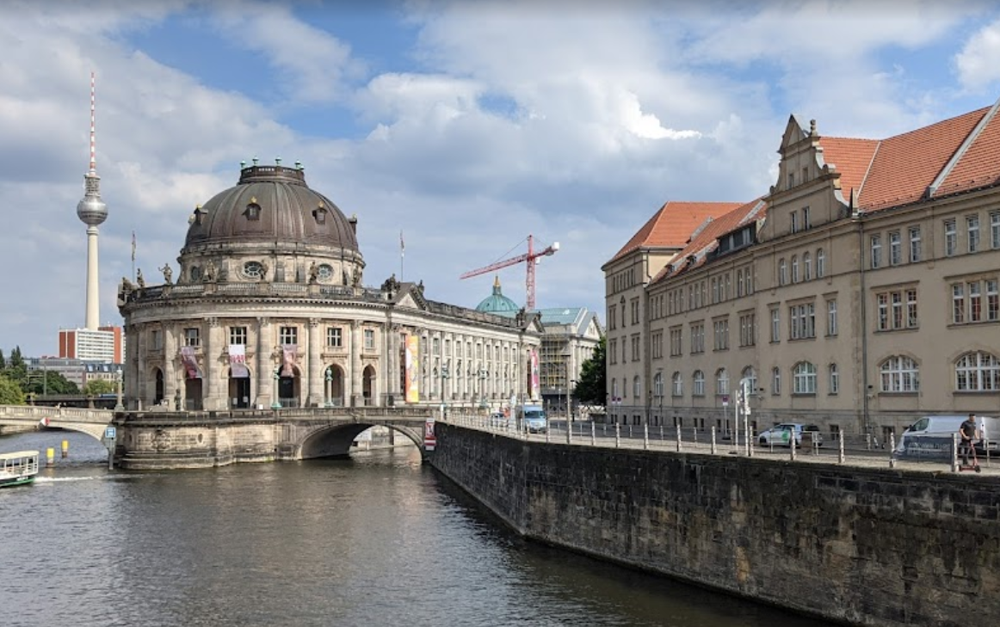
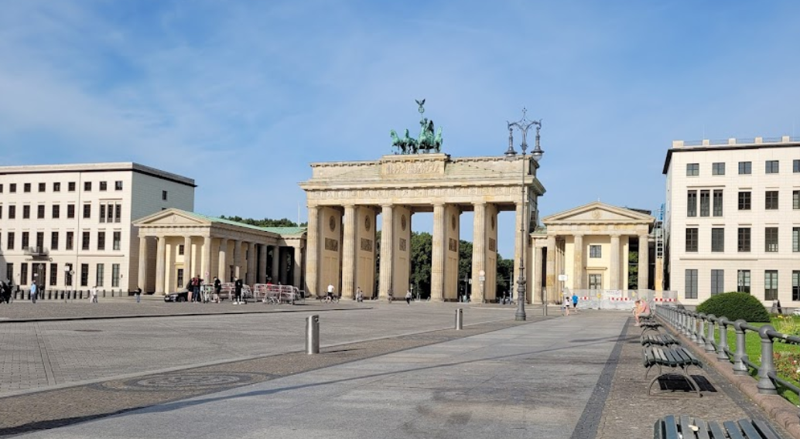

# Guide for History Addicts 

## Route for Berlin 

If you have a short time to visit Berlin but want to see as many museums as possible in this short time, this route is for you! We are going to follow the *Unter den Linden line* from *Alexanderplatz* to *Brandenburger Tor*.

1. Alexanderplatz - Marienkirche
2. Berliner Dom
3. Museum Island
- Pergamon Museum
- Pergamon Museum Das Panaroma
- Neues Museum
- Bode Museum
4. Brandenburger Tor

###### If you want to eat something before starting the trip, check out Marcio's [food guide](marcio.md).

### 1. Alexanderplatz - Marienkirche

### 2. Berliner Dom

### 3. Museum Island

- Pergamon Museum

- Pergamon Museum Das Panaroma

- Neues Museum

- Bode Museum

### 4. Brandenburger Tor

